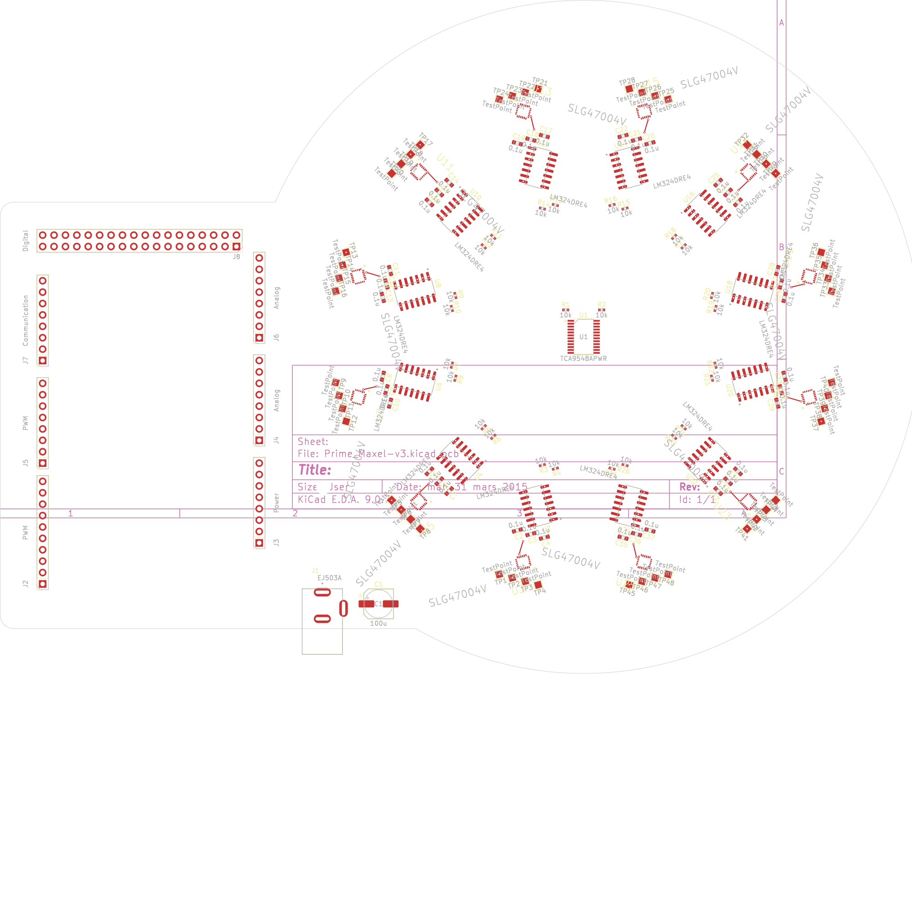
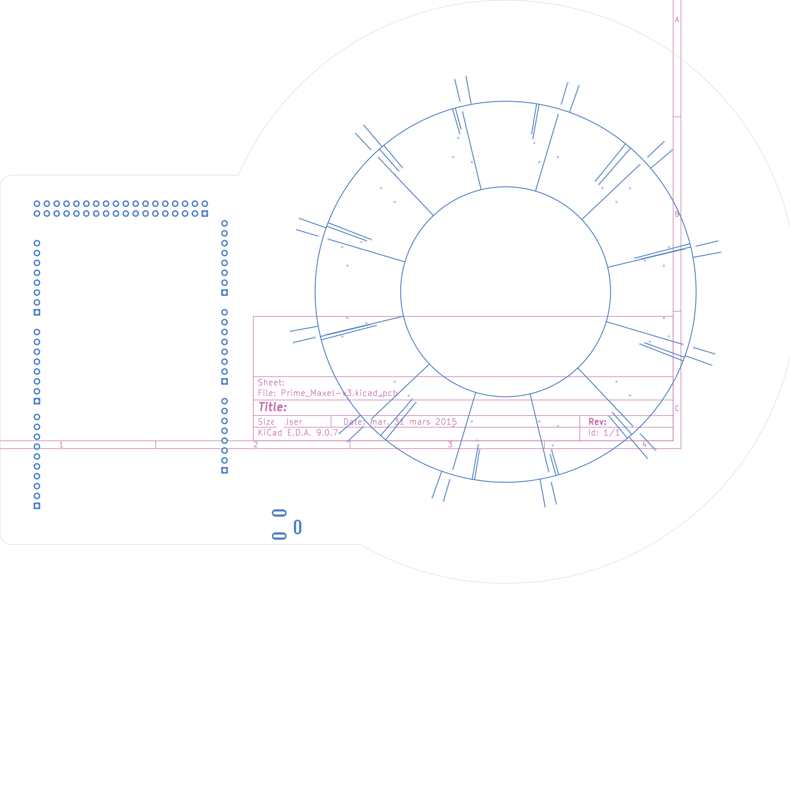
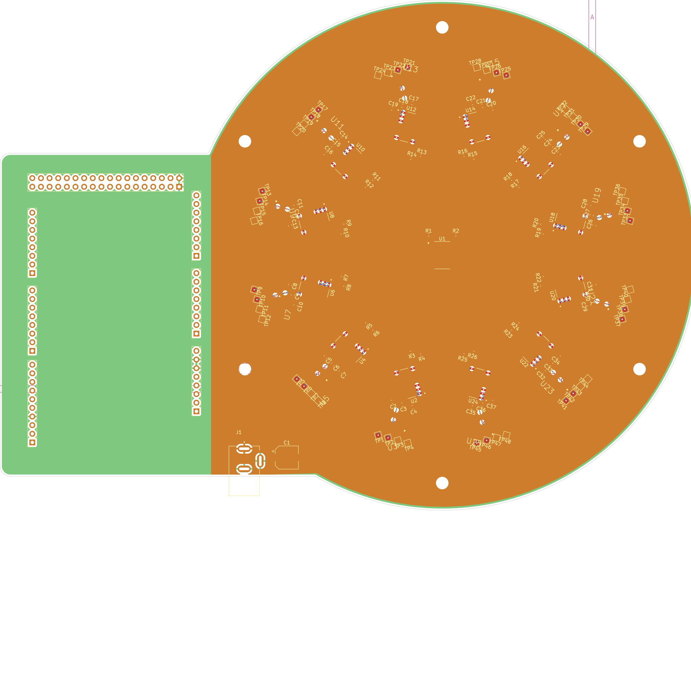

# Prime_Maxel-v3 — Circular Sensor Array PCB

A **4-layer Arduino Mega shield** featuring **12 radial analog measurement cells** arranged in a circular pattern. Designed in **KiCad 9** for research instrumentation.

## Board Overview

| Top Layer (F.Cu) | Bottom Layer (B.Cu) | All Layers |
|:-:|:-:|:-:|
|  |  |  |

## Key Specs

| Parameter | Value |
|-----------|-------|
| **Layers** | 4 (F.Cu / GND / VCC / B.Cu) |
| **Board shape** | Rectangular shield + circular sensor area |
| **Measurement cells** | 12 × identical, 30° radial spacing |
| **ICs per cell** | SLG47004V (GreenPAK) + LM324DRE4 (quad op-amp) |
| **I2C management** | TCA9548A 8-ch multiplexer |
| **Critical traces** | 0.229mm (50Ω matched) differential pairs on B.Cu |
| **Stackup** | 1.6mm, 2oz Cu, FR4 (εr ≈ 4.5) |
| **Target fab** | JLCPCB (JLC04161H-7628) |

## Architecture

```
Arduino Mega (I2C) → TCA9548A Mux → 12× SLG47004V (configure)
                                          ↓
                                    LM324 Bridge Circuit
                                    (TORSION_A ↔ TORSION_B)
                                          ↓
                                    Concentric ring traces (B.Cu)
                                          ↓
                                    48× Test points for measurement
```

Each cell implements a **differential measurement bridge** using the LM324's four op-amp channels. The SLG47004V provides programmable excitation signals via I2C. The differential signals route to **concentric ring traces** on the back copper layer.

## Current Status

**Done ✅**
- Complete schematic (main sheet + 12 sub-sheets)
- All components placed
- Board outline, GND plane (In1.Cu), VCC plane (In2.Cu)
- Net classes configured (Default / Power_Bulk / Torsion_Bridge)
- JLCPCB DRC rules

**Needs Completing 🔧**
1. TORSION signal routing on B.Cu (cells → concentric rings)
2. I2C bus routing on F.Cu
3. Power connections via internal planes
4. Inter-chip signal routing (SLG47004V ↔ LM324)
5. Ground via stitching
6. DRC cleanup

See [PCB_Design_Brief.md](PCB_Design_Brief.md) for full technical details.

## Files

| File | Description |
|------|-------------|
| `Prime_Maxel-v3.kicad_pro` | Project (net classes, DRC settings) |
| `Prime_Maxel-v3.kicad_sch` | Main schematic |
| `golden_cell.kicad_sch` | Golden Cell sub-sheet |
| `Prime_Maxel-v3.kicad_pcb` | PCB layout (partially routed) |
| `Prime_Maxel-v3.kicad_dru` | Custom DRC rules (JLCPCB) |
| `Libraries/` | Custom footprints & symbols |

## Help Wanted

Looking for routing assistance from experienced KiCad users. See the [KiCad forum thread](#) for discussion. Happy to discuss compensation for significant contributions.

## License

This is a research project by [Tusk Innovations](https://github.com/nagapi2357-ui). All rights reserved.

---

*Contact: Adrian — Tusk Innovations*
