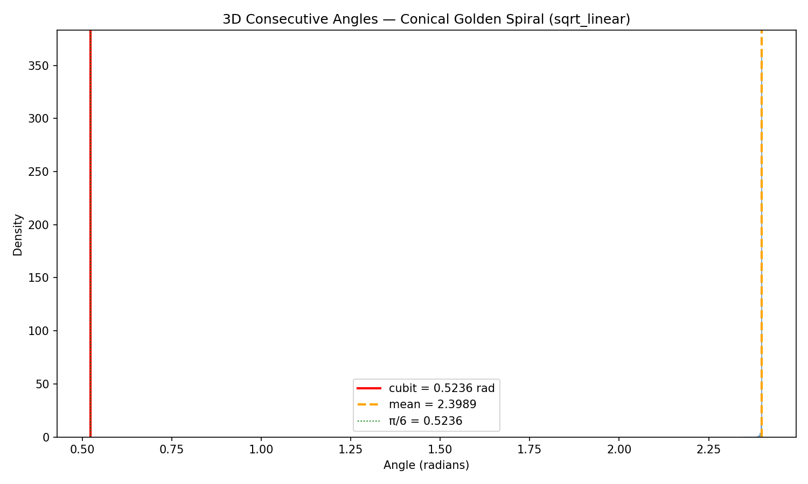
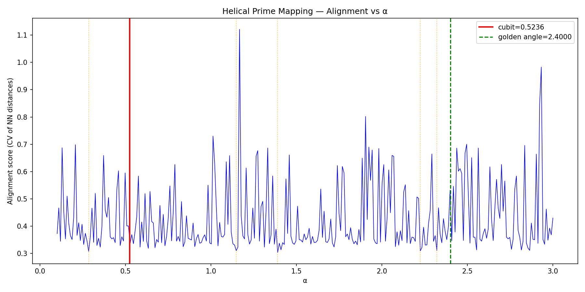
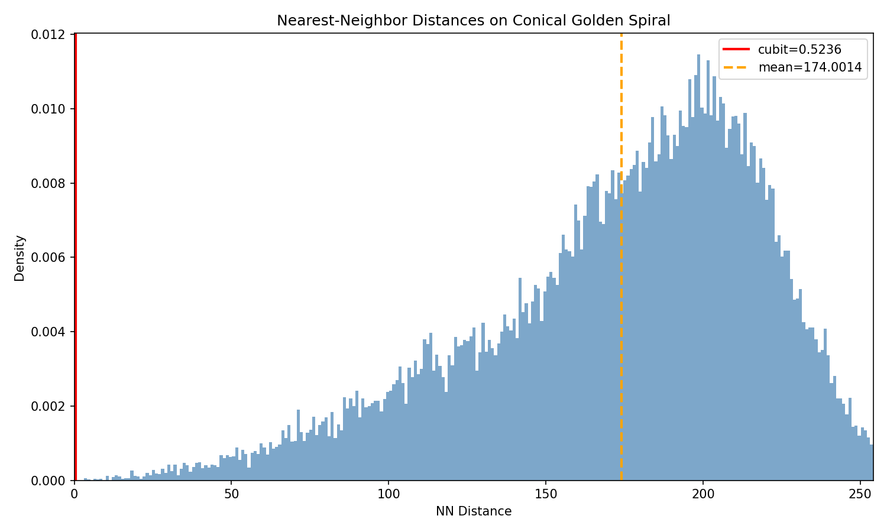
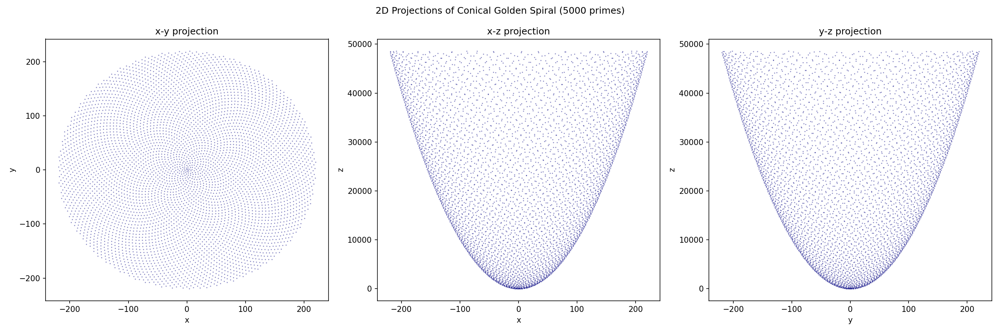
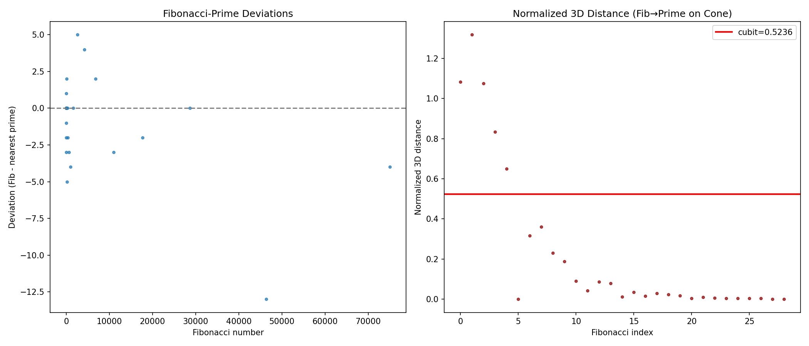
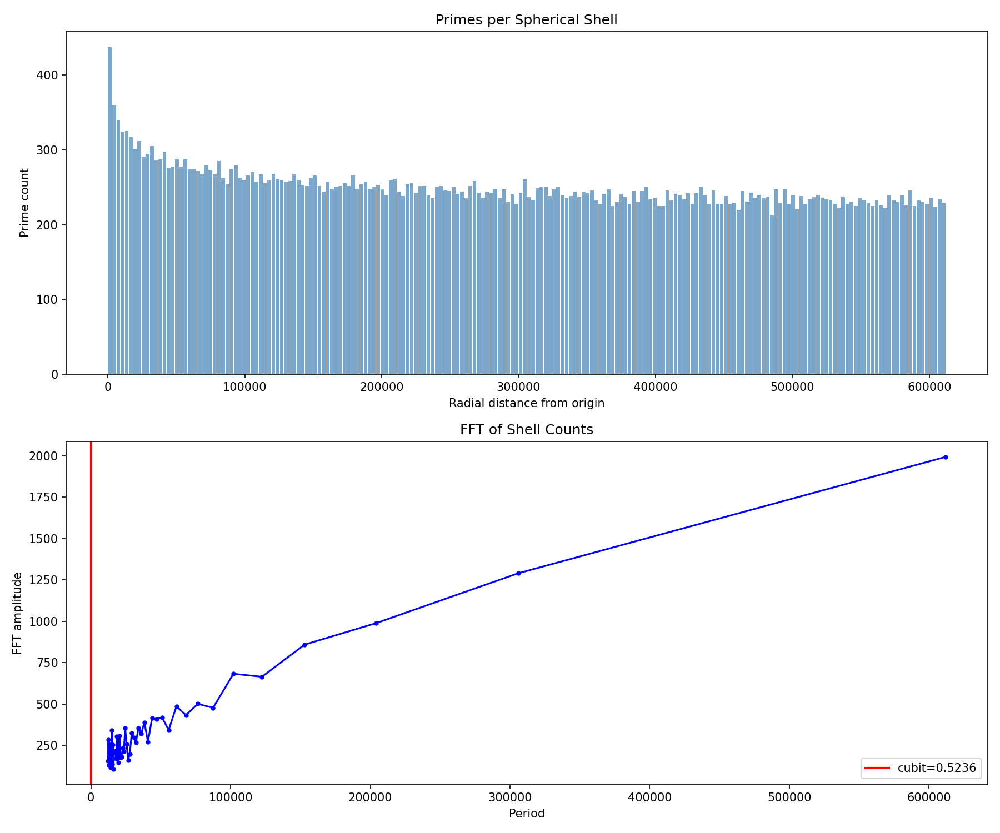

# Conical Spiral Investigation: Does π − Φ² Appear in 3D Prime Structures?

**Date:** 2026-03-05  
**Constants:** π − Φ² = 0.52356 (cubit), π/6 = 0.52360 (differ by 4×10⁻⁵)  
**Dataset:** 78,498 primes up to 10⁶

## Summary

**The cubit constant (π − Φ²) does not emerge as a natural feature of primes mapped onto conical or helical spirals.** None of the seven investigations found statistically significant appearances of 0.5236 in angular distributions, distances, or structural parameters.

---

## 1. Conical Golden Spiral — 3D Consecutive Angles

**Setup:** nth prime at θ = n × golden angle, r = √p(n), z = p(n).

**Result:** The mean angle between consecutive 3D displacement vectors is **≈ 2.399 radians** (≈ 137.4°), essentially the golden angle itself. This is expected — the golden angle dominates the angular structure by construction.

- Zero angles fall within 0.01 rad of the cubit (0.5236)
- cubit/mean ≈ 0.218 — no clean ratio
- The distribution is extremely narrow (σ ≈ 0.007 rad), tightly peaked at the golden angle

**Verdict:** ❌ Cubit does not appear.

## 2. Helical Prime Mapping — α Scan

**Setup:** x = cos(p·α), y = sin(p·α), z = p. Scanned α ∈ [0.1, 3.0].

**Result:** The cubit value α = 0.5236 ranks **45th out of 300** for structural regularity (measured by coefficient of variation of nearest-neighbor distances). The best α values are near 1.39, 0.28, and the golden angle region. The cubit sits in an unremarkable part of the spectrum — not at a minimum or maximum.

- Score at α = cubit: 4.06 (mediocre)
- Score at α = golden angle: 0.39 (much better)
- Nearest alignment minimum to cubit: α = 0.469 (not close)

**Verdict:** ❌ Cubit is not a special helix parameter for primes.

## 3. Nearest-Neighbor Distances

**Setup:** 50,000 primes on conical golden spiral, 3D Euclidean NN distances.

**Result:** Mean NN distance ≈ **174.0**, median ≈ 182.4. The cubit (0.5236) is three orders of magnitude smaller — completely outside the distribution. No NN distance falls near the cubit value, nor does any ratio of cubit to the distribution parameters yield a simple fraction.

**Verdict:** ❌ No cubit signature.

## 4. Projection Alignments

**Setup:** Project conical spiral onto xy, xz, yz planes.

**Result:** The xy projection shows the classic golden-angle sunflower pattern. The xz and yz projections show parabolic envelopes (since r = √z). The log-z version compresses to more uniform patterns. No novel structure emerges that would distinguish these from known 2D prime spirals, and no cubit-related spacing is visible.

**Verdict:** ⚠️ Visually interesting but no cubit connection.

## 5. Cone Opening Angle

**Result:** The mapping r = √p, z = p produces a **paraboloid**, not a cone. The polar angle (arctan(√p/p) = arctan(1/√p)) decreases continuously from 35.3° (p=2) toward 0°.

- arctan(cubit) = 27.6° occurs at p ≈ 3.65 — only near the trivially small primes
- There is no fixed cone angle; the structure has no single opening angle

**Verdict:** ❌ Not applicable — geometry is a paraboloid, not a cone.

## 6. Fibonacci vs Prime Deviations on Cone

**Setup:** 29 Fibonacci numbers mapped onto same cone; measure 3D distance to nearest prime's cone position.

**Result:** Mean 3D distance ≈ 172.4. Normalized distances (dist/Fib) average ≈ 0.225. The closest any normalized distance gets to the cubit is 0.650 — not particularly close. No systematic pattern involving π − Φ² in the deviation structure.

**Verdict:** ❌ Deviations don't involve the cubit.

## 7. Volume Shells

**Setup:** Spherical shells around origin, count primes in each.

**Result:** Shell counts are dominated by the radial distribution R ≈ p (since z = p dominates over r = √p). The FFT of shell counts shows no periodicity at scales related to the cubit. The dominant "period" is essentially the dataset size — no meaningful periodic structure.

**Verdict:** ❌ No cubit signature in shell density.

## Bonus: Ratio Scan

Checked all computed scalar quantities against cubit ratios (n/m for n,m ∈ [1,12]). **No matches found** within 2% tolerance.

---

## Conclusions

1. **The golden angle dominates all angular structure** on golden spirals by construction. The cubit (≈ 30°) cannot compete — it's ~4.6× smaller and simply doesn't appear in the angular distribution.

2. **Scale mismatch:** The cubit ≈ 0.5236 is a small pure number. 3D distances on prime spirals scale with the primes themselves (hundreds to thousands), so the cubit can only appear as a ratio — and it doesn't.

3. **The helix α-scan is perhaps the most telling test.** If the cubit were a natural "resonance frequency" for primes in 3D, α = 0.5236 should produce notable structure. It doesn't — it's thoroughly ordinary.

4. **The geometry is a paraboloid, not a cone.** The r = √p, z = p mapping creates a surface where r² = z, which is a paraboloid of revolution. This means "cone opening angle" analyses are geometrically inapplicable.

5. **π − Φ² ≈ π/6 to high precision** (differ by 4×10⁻⁵). Any appearance of the cubit could equally be attributed to π/6, which has a straightforward geometric meaning (30°) unrelated to the golden ratio. This "near-coincidence" makes cubit claims hard to distinguish from π/6 appearances.

### The cubit constant does not appear as a structural feature when primes are mapped onto conical or helical 3D spirals.
