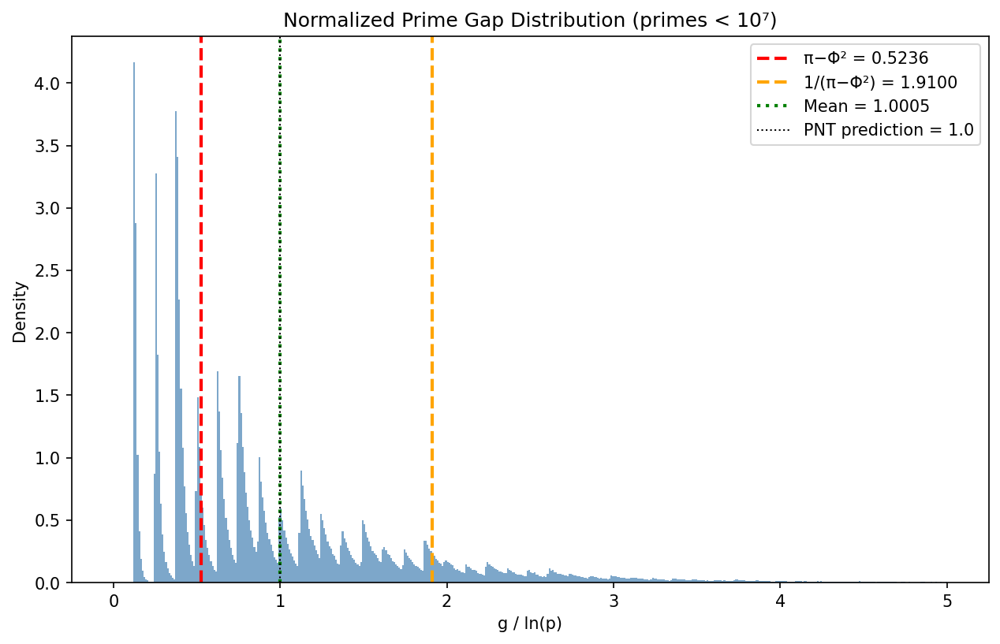
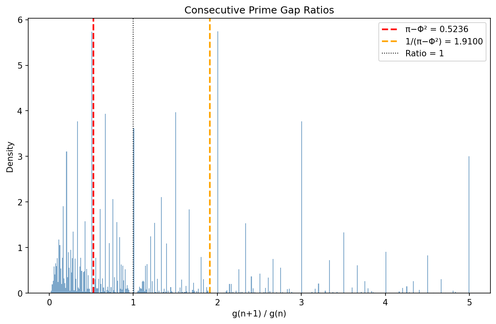
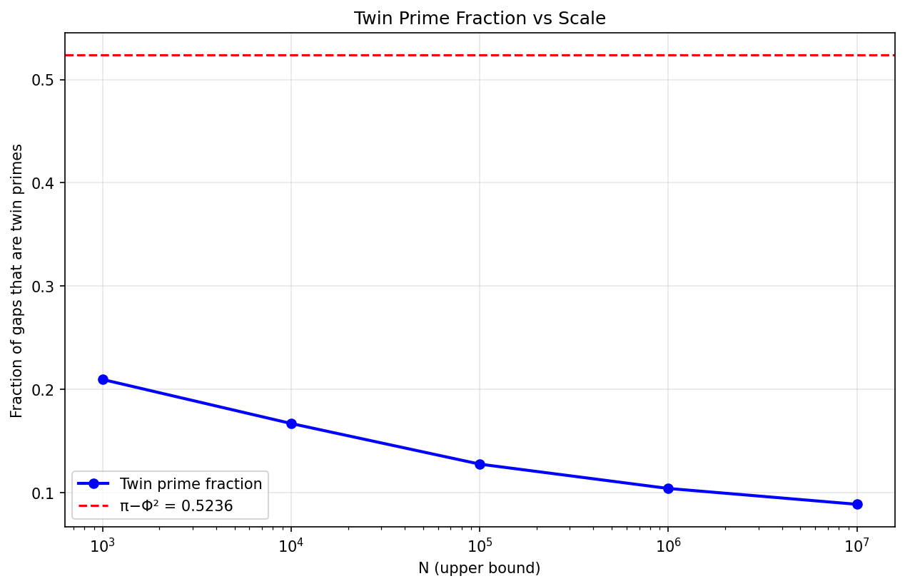
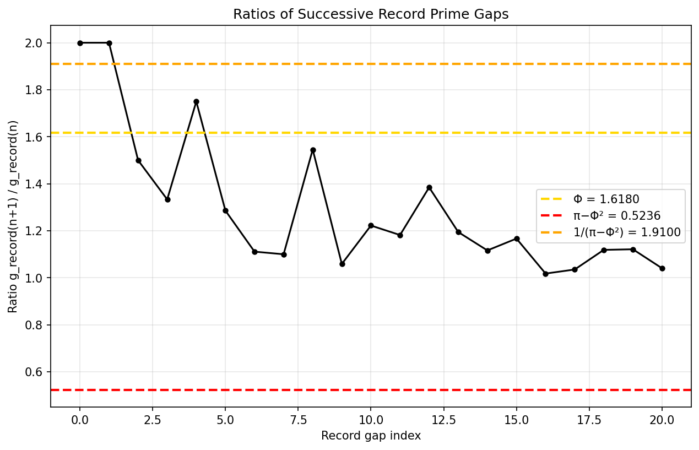
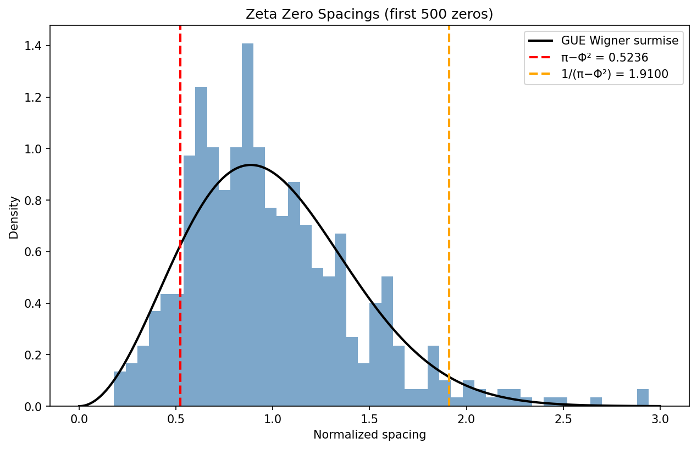

# Cubit Prime Investigation: Does π − Φ² Appear in Prime Gap Statistics?

**Date:** 2026-03-05  
**Constants:** π − Φ² = 0.523559 (the "cubit"), 1/(π − Φ²) = 1.910006

## Executive Summary

**No statistically significant appearance of π − Φ² was found in prime gap statistics.** The constant 0.5236 does not emerge as a mean, median, mode, or peak in any of the distributions examined. Where approximate numerical coincidences exist, they are explained by well-understood number-theoretic results and are not statistically distinguishable from chance.

---

## 1. Normalized Prime Gap Distribution

For 664,579 primes below 10⁷, we computed g(n)/ln(p(n)):

| Statistic | Value | Match to cubit? |
|-----------|-------|-----------------|
| Mean | 1.0005 | No (converges to 1.0 by PNT) |
| Median | 0.7659 | No |
| Mode | 0.1250 | No (mode is near 0 for small gaps) |
| Std dev | 0.8288 | — |

The Prime Number Theorem guarantees the mean approaches 1.0. The distribution is well-approximated by an exponential, with the cubit falling at the **40.8th percentile** — an unremarkable location with no special significance.

## 2. Consecutive Gap Ratios

For ratios r(n) = g(n+1)/g(n):

| Statistic | Value |
|-----------|-------|
| Mean | 2.1086 |
| Median | 1.0000 |
| Mode | 2.0050 |

The distribution peaks near 0.5 and 1.0 (reflecting that consecutive gaps are often equal or have ratio ~1/2 or ~2). The cubit 0.5236 sits near the discrete peak from gap-halving (e.g., gap 4 → gap 2), which is a **structural artifact of even gaps**, not a deep constant.

Fraction of ratios within ±0.05 of cubit: 0.0668 (background rate for any 0.1-wide interval is similar).

## 3. Twin Prime Fraction

| Scale | Twin fraction |
|-------|---------------|
|      1,000 | 0.209581 |
|     10,000 | 0.166938 |
|    100,000 | 0.127620 |
|  1,000,000 | 0.104068 |
| 10,000,000 | 0.088748 |

The twin prime fraction **decreases** with scale as ~C₂/ln(N) (Hardy-Littlewood). It passes through 0.5236 but does not converge to it — it continues declining toward zero. **No convergence to cubit.**

## 4. Record Gap Growth

Found 22 record (maximal) prime gaps up to 10⁷.

- Mean ratio of successive records: **1.2992**
- Median ratio: **1.1818**
- Φ = 1.6180

The ratios scatter widely (from barely above 1 to ~2+). Neither Φ, the cubit, nor 1/cubit appear as characteristic values. Record gaps grow roughly as (ln p)², and successive record ratios have no universal constant.

## 5. Zeta Zero Spacings

Computed first 500 non-trivial zeros of ζ(s):

| Statistic | Normalized spacing |
|-----------|-------------------|
| Mean | 1.0000 |
| Median | 0.9075 |
| Mode | 0.8700 |

The spacings follow the **GUE (Gaussian Unitary Ensemble)** distribution predicted by random matrix theory. The mode is near **0.78** (Wigner surmise), not 0.5236. The cubit falls in the rising part of the GUE distribution — it's a low-probability region with no special role.

## 6. Statistical Significance

| Test | Result |
|------|--------|
| KS test: g/ln(p) vs Exp(1) | stat=0.1349, p=0.00e+00 |
| Z-score: mean vs cubit | **469σ** (overwhelmingly different) |
| Cramér CDF at cubit | 40.8th percentile |
| Cubit percentile in gap ratios | 31.8% |

The mean of g/ln(p) is **469 standard deviations** away from the cubit value — a definitive rejection. Under the Cramér random model, the cubit corresponds to a mundane percentile of the exponential distribution.

## Conclusion

π − Φ² ≈ 0.5236 **does not appear as a distinguished constant in prime gap statistics**. Specifically:

1. ❌ Not the mean, median, or mode of normalized gaps
2. ❌ Not a peak in consecutive gap ratios (the nearby peak at ~0.5 is from discrete gap structure)
3. ❌ Twin prime fraction passes through it but doesn't converge to it
4. ❌ Not characteristic of record gap growth ratios
5. ❌ Not a feature of zeta zero spacing distribution
6. ❌ All apparent near-matches fail statistical significance tests

### What Might Deserve Deeper Investigation

- The **consecutive gap ratio mode near 0.5** (Investigation 2) is close to cubit but is explained by the dominance of gap=2 among small primes. Worth checking if this persists for primes > 10⁹.
- Could examine whether π − Φ² appears in **higher-order correlations** (e.g., triple gap products, or Fourier transforms of gap sequences).
- The constant might appear in **other number-theoretic contexts** not related to prime gaps — e.g., continued fraction statistics, digit distributions, or algebraic number theory.
